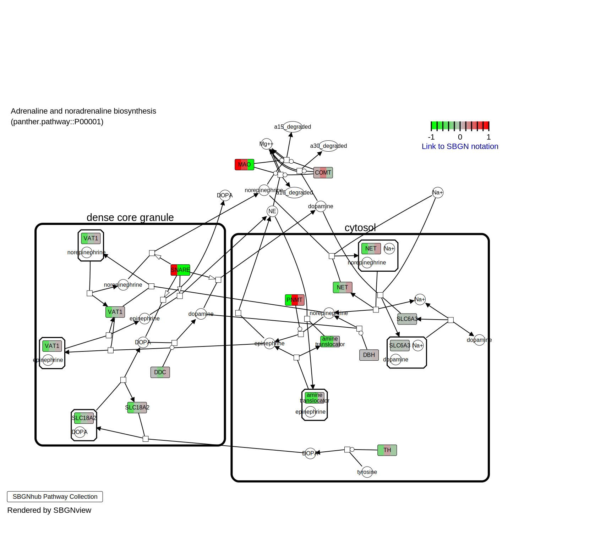

# SBGNview 

[](https://www.bioconductor.org/packages/SBGNview)
[](https://github.com/datapplab/SBGNview)


## Overview
We previously developed an R/BioConductor package called [Pathview](https://www.bioconductor.org/packages/pathview), which maps, integrates and visualizes a wide range of data onto KEGG pathway graphs. Since its publication, Pathview has been widely used in omics studies and data analyses and has become the leading tool in its category. Here we introduce the SBGNview package, which adopts [Systems Biology Graphical Notation (SBGN)](https://sbgn.github.io/) and greatly extends the Pathview project by supporting multiple major pathway databases beyond KEGG.

Key features:

* Pathway diagram and definition by SBGN standard formats;

* Supports multiple major pathway databases beyond KEGG and user defined pathways;

* Covers 5,200 reference pathways and over 3,000 species by default;

* Extensive graphics controls, including glyph and edge attributes, graph layout and sub-pathway highlight;

* SBGN pathway data manipulation, processing, extraction and analysis.

## Citation

Please cite the following papers when using this open-source  package. This will help the project and our team:

Luo W, Brouwer C. Pathview: an R/Biocondutor package for pathway-based data integration and visualization. Bioinformatics, 2013, 29(14):1830-1831, <a href=https://doi.org/10.1093/bioinformatics/btt285>doi: 10.1093/bioinformatics/btt285</a>


Dong X, Vegesna K, Luo W. SBGNview: SBGN for pathway based data analysis, integration and visualization, Submitted, 2020.

## Installation

### Prerequisites
*SBGNview* depends or imports from the following R packages:

* xml2: parse SBGN-ML files
* rsvg: convert svg files to other formats (pdf, png, ps). librsvg2 is needed to install rsvg. See this page for more details: https://github.com/jeroen/rsvg
* igraph: find shortest paths
* httr: search [SBGNhub](https://github.com/datapplab/SBGNhub/tree/master/data/id.mapping.unique.pair.name) for mapping files
* KEGGREST: generate mapping tables from scratch when needed
* [pathview](https://bioconductor.org/packages/release/bioc/html/pathview.html): map between different ID types for gene and chemical compound
* [gage](https://bioconductor.org/packages/release/bioc/html/gage.html): R package for pathway enrichment analysis.
* [SBGNview.data](https://bioconductor.org/packages/release/data/experiment/html/SBGNview.data.html): demo and supportive datasets for SBGNview package
* [SummarizedExperiment](https://bioconductor.org/packages/release/bioc/html/SummarizedExperiment.html): alternative input user data as SummarizedExperiment objects
* AnnotationDbi: BioConductor annotation data and infrastructure

Note these dependencies will be automatically installed when SBGNview is installed from BioConductor or GitHub. To install them manually within R:

```{r setup, eval = FALSE}
if (!requireNamespace("BiocManager", quietly = TRUE)){
     install.packages("BiocManager")
}
BiocManager::install(c("xml2", "rsvg", "igraph", "httr", "KEGGREST", "pathview", "gage", "SBGNview.data", "SummarizedExperiment", "AnnotationDbi"))
```

External dependencies (outside R):
**Windows 10**: none

**Linux (Ubuntu)**: needs additional packages (libxml2-dev, libssl-dev, libcurl4-openssl-dev, librsvg2-dev) to be installed. Run the command below in a terminal to install the necessary packages. The same or similar packages can be found for other distributes of linux.
```{r depend, eval = FALSE}
sudo apt install libxml2-dev libssl-dev libcurl4-openssl-dev librsvg2-dev
```

### Install SBGNview
Install SBGNview through Bioconductor: 
```{r install, eval = FALSE}
BiocManager::install(c("SBGNview"))
```
Install SBGNview through GitHub:
```{r install.1, eval = FALSE}
install.packages("devtools")
devtools::install_github("datapplab/SBGNview")
```
Clone the Git repository:
```{r clone.git, eval = FALSE}
git clone https://github.com/datapplab/SBGNview.git
```


## Quick example
```{r, echo = TRUE, eval = TRUE, results = 'hide', message = FALSE, warning = FALSE}
library(SBGNview)
# load demo dataset, SBGN pathway data collection and info, which may take a few seconds
data("gse16873.d","pathways.info", "sbgn.xmls")
input.pathways <- findPathways("Adrenaline and noradrenaline biosynthesis")
SBGNview.obj <- SBGNview(
          gene.data = gse16873.d[,1:3], 
          gene.id.type = "entrez",
          input.sbgn = input.pathways$pathway.id,
          output.file = "quick.start", 
          output.formats =  c("png")
          ) 
print(SBGNview.obj)
```
Two image files (a svg file by default and a png file) will be created in the current working directory.
   

## Additional information
SBGN website: https://sbgn.github.io/

For any questions, please contact Kovidh Vegesna (kvegesna [AT] uncc.edu) or Weijun Luo (luo_weijun [AT] yahoo.com)
